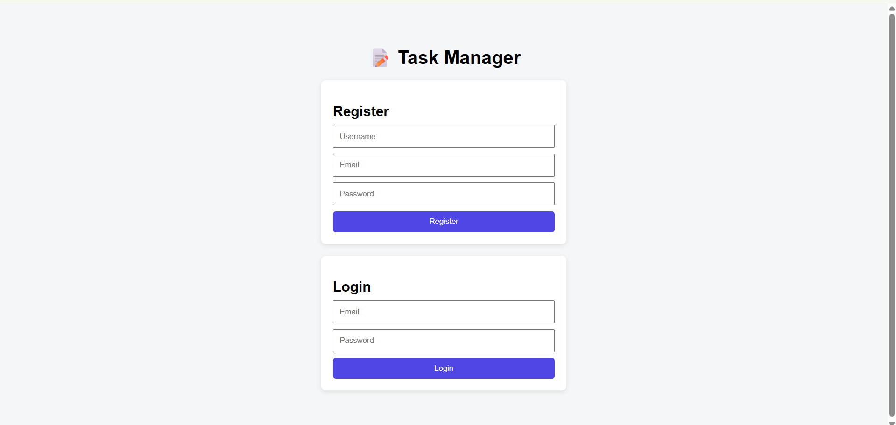
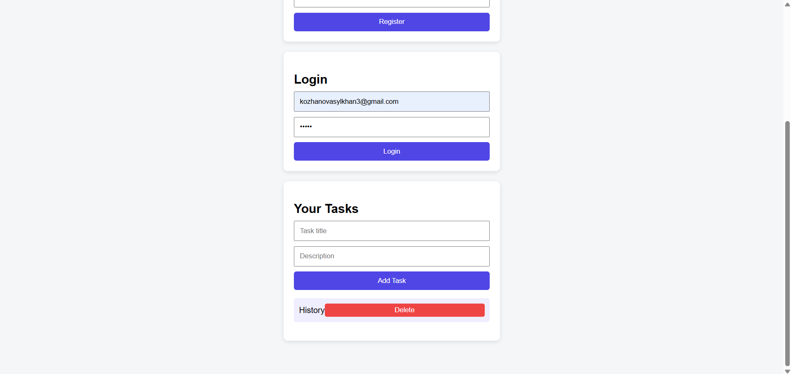
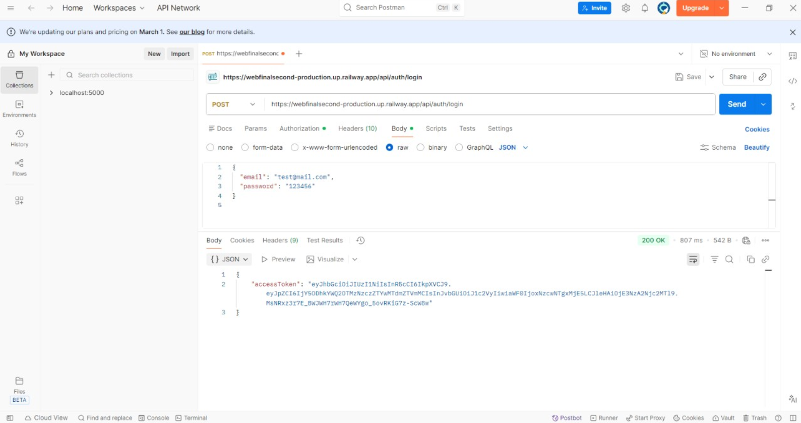

#  Task Manager Web Application

##  Project Overview
This project is a full-stack **Task Manager web application** that allows users to register, log in, and manage their personal tasks.  
The backend is built with **Node.js and Express**, data is stored in **MongoDB Atlas**, and authentication is implemented using **JWT (JSON Web Tokens)**.  
The frontend is a simple, responsive web interface built with **HTML, CSS, and JavaScript**.

Each user can only access and manage **their own tasks**, ensuring data privacy and security.

---

##  Technologies Used

### Backend
- Node.js
- Express.js
- MongoDB Atlas
- Mongoose
- JWT (jsonwebtoken)
- bcryptjs
- dotenv
- cors

### Frontend
- HTML
- CSS
- JavaScript (Fetch API)

---

##  Project Structure
task-manager-api/
│
├── app/
│ ├── config/ # Database and JWT configuration
│ ├── controllers/ # Business logic
│ ├── models/ # MongoDB schemas
│ ├── routes/ # API routes
│ └── middleware/ # Authentication and error handling
│
├── client/ # Frontend files
│ ├── index.html
│ ├── style.css
│ └── script.js
│
├── server.js # Entry point
├── .env # Environment variables
├── package.json
└── README.md

---
Install dependencies
npm install

Create .env file
PORT=5000
MONGO_URI=your_mongodb_atlas_uri
JWT_SECRET=your_secret_key

Run the server
npm run dev

Authentication Flow

User registers using /api/auth/register

Password is encrypted with bcrypt

User logs in via /api/auth/login

Server returns a JWT token

Token is sent in request headers to access protected routes

API Documentation
Auth (Public)
Register
POST /api/auth/register

Body:

{
  "username": "user",
  "email": "user@mail.com",
  "password": "123456"
}

Login
POST /api/auth/login

User (Private – JWT required)
Get Profile
GET /api/users/profile

Update Profile
PUT /api/users/profile

Tasks (Private – JWT required)
Create Task
POST /api/tasks

Get All Tasks
GET /api/tasks

Get Task by ID
GET /api/tasks/:id

Update Task
PUT /api/tasks/:id

Delete Task
DELETE /api/tasks/:id

Frontend Features

User registration and login

JWT-based authentication

Create and delete tasks

Responsive and readable UI

Works on desktop and mobile

Testing

All API endpoints were tested using Postman:

Authentication

JWT-protected routes

CRUD operations

Deployment

The project is deployed on Render / Railway.
Sensitive data such as database credentials and JWT secrets are stored using environment variables.

Githab link 
https://github.com/asssoygo/WEBFINALSECOND

 Deployed URL:

[https://webfinalsecond-production.up.railway.app]

## Frontend

The frontend is a simple web interface built with HTML, CSS, and JavaScript.

For demonstration purposes, the frontend is run locally and connects to the deployed backend API.

All core features are implemented:
- user registration and login
- task creation
- task listing
- task deletion

## Screenshots

Screenshots demonstrating:
- User registration
- User login
- Task creation
- Task listing and deletion

